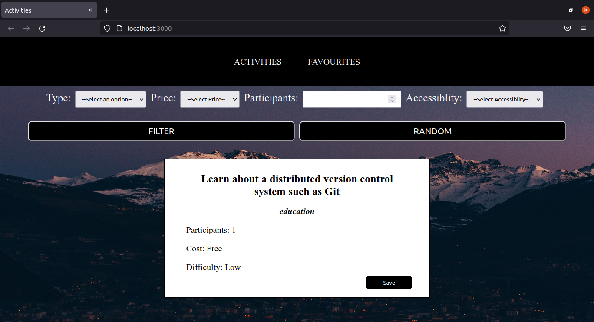

## How to Run?

This app was created using Create React App. To run this package follow the steps below

1. Clone the github repository.
2. Install Node.js.
3. cd into the activities folder using your terminal.
4. run command `npm install` to install all the dependencies for the project.
5. run command `npm start` to start the server.

## What is the project?

This project is a single page front end web application built using React and Node.js for a free 3rd party API called the [Bored API](https://www.boredapi.com).

There are two pages in the website that can be navigated to using the links in the navigation bar found at the top of the website.

1. #### Activities Page

This is the default page where users can fetch an activity. The activity fetched can be random using the Random button on page, alternatively users can also do an advanced search using the Filter button and selecting different filters for their search parameters to suit their needs.

On this page users can also save activities that they like. The data is stored in the browsers local storage and can be viewed later when the user desires.

2. #### Favourites Page

On this page users can view their saved activities and also remove activities that they don't like from thier saved list.

## Tech Stack used for the project

- React
- Create React App

## About [Bored API](https://www.boredapi.com)

The Bored API helps you find things to do when you're bored! There are fields like the number of participants, activity type, and more that help you narrow down your results.

Visit the [Bored API](https://www.boredapi.com) website: https://www.boredapi.com